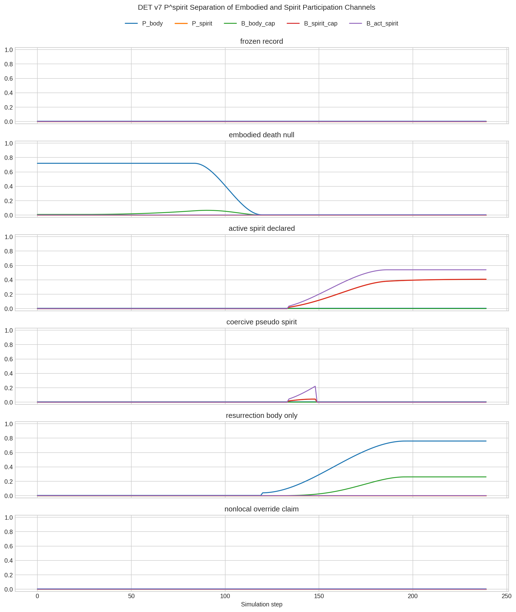
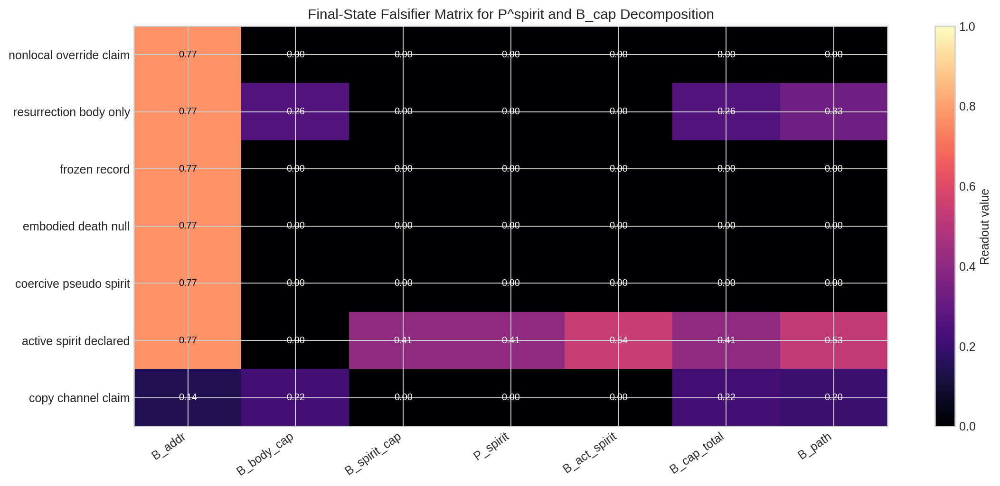
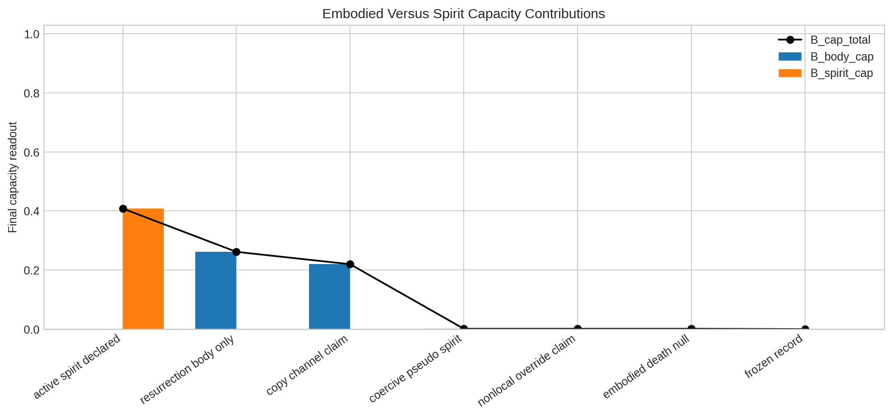
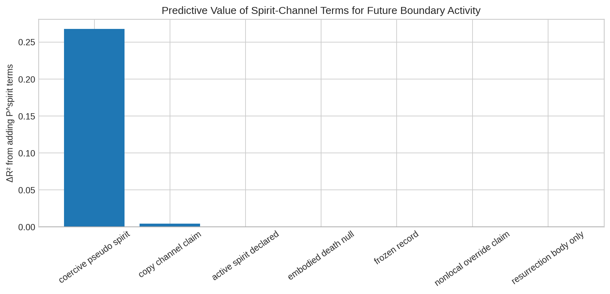

# P^spirit Participation Simulation Results

**Author:** Manus AI  
**Date:** May 31, 2026  
**Status:** Deterministic readout-first simulation; non-canonical unless separately promoted

## 1. Purpose

This simulation tests whether the DET v7 `B_cap` term can be decomposed into embodied and spirit capacity channels without assuming that death automatically collapses all possible participation. The experiment distinguishes frozen record, embodied death under a channel-null assumption, a declared lawful spirit-channel hypothesis, copy controls, coercive pseudo-spirit controls, resurrection through body capacity, and nonlocal override claims.

## 2. Falsifier checks

| Check | Passed |
|---|---:|
| `frozen_record_has_address_without_spirit_activity` | true |
| `death_null_collapses_body_not_total_by_theorem` | true |
| `declared_spirit_channel_survives_body_collapse_when_gates_pass` | true |
| `copy_claim_fails_path_despite_host_capacity` | true |
| `coercive_pseudo_spirit_fails_noncoercion_gate` | true |
| `resurrection_can_restore_body_capacity_without_spirit_channel` | true |
| `nonlocal_override_rejected_even_with_channel_claim` | true |

## 3. Final scenario readouts

| Scenario | B_addr | P_body | P_spirit | B_body_cap | B_spirit_cap | B_cap_total | B_act_spirit | B_path | Active spirit |
|---|---:|---:|---:|---:|---:|---:|---:|---:|---:|
| nonlocal override claim | 0.770 | 0.004 | 0.000 | 0.001 | 0.000 | 0.001 | 0.000 | 0.000 | false |
| resurrection body only | 0.770 | 0.760 | 0.000 | 0.262 | 0.000 | 0.262 | 0.000 | 0.331 | false |
| frozen record | 0.770 | 0.003 | 0.000 | 0.000 | 0.000 | 0.000 | 0.000 | 0.000 | false |
| embodied death null | 0.770 | 0.004 | 0.000 | 0.001 | 0.000 | 0.001 | 0.000 | 0.000 | false |
| coercive pseudo spirit | 0.770 | 0.004 | 0.000 | 0.001 | 0.000 | 0.001 | 0.000 | 0.001 | false |
| active spirit declared | 0.770 | 0.004 | 0.408 | 0.000 | 0.408 | 0.408 | 0.540 | 0.531 | true |
| copy channel claim | 0.143 | 0.730 | 0.000 | 0.220 | 0.000 | 0.220 | 0.000 | 0.199 | false |

## 4. Interpretation

The key result is that `B_addr > 0` is not sufficient for active spirit participation. Frozen record and conservative death-null scenarios preserve addressability while leaving `P_spirit`, `B_spirit_cap`, and `B_act_spirit` near zero. The declared spirit-channel scenario shows the logical form of a non-circular positive case: embodied participation remains near zero, but `P_spirit` becomes positive only when addressability, path-continuity, declared channel availability, locality, lawfulness, non-coercion, and agency compatibility all pass.

Copy, coercion, and nonlocal override controls demonstrate why `P_spirit` must be gate-constrained. Pattern similarity alone cannot create path-continuity; apparent high boundary effect cannot count as lawful spirit participation if agency variation is suppressed; and channel claims fail when locality is absent. Resurrection is separated from spirit participation because it restores `B_body_cap` through a capable host while keeping `B_spirit_cap` at zero under the conservative channel-null setting.

