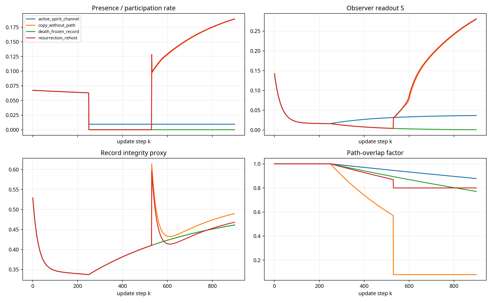
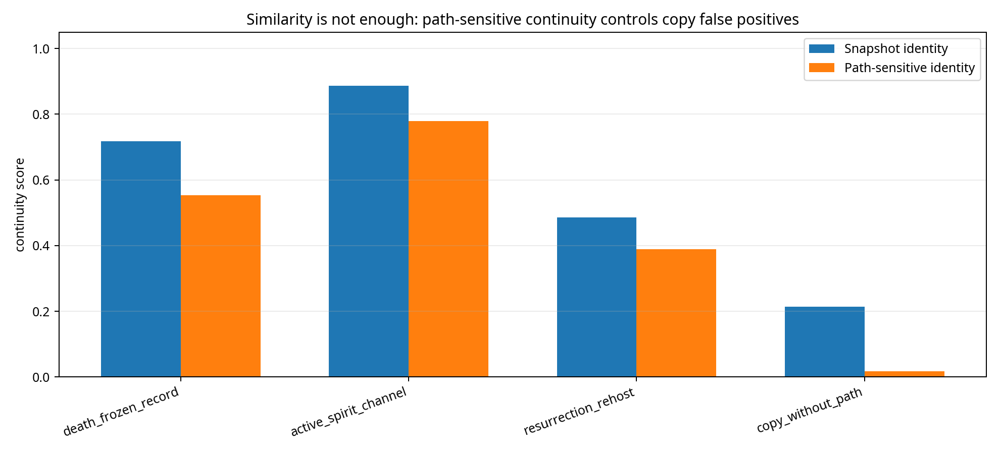
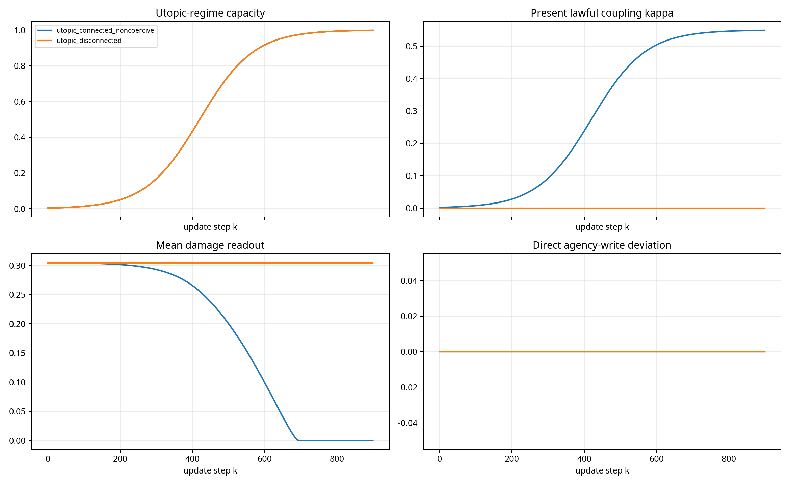

# DET v7 Falsifier Edge-Case Simulation Results

These deterministic edge-case simulations test death-state participation collapse, record persistence, active-channel requirements, resurrection continuity, copy controls, and non-coercive utopic-boundary coupling. They are falsifier scaffolds, not empirical proof of metaphysical claims.

## Summary

| family             | scenario                     |   final_presence |   final_selfhood_S |   record_integrity |   declared_spirit_channel |   snapshot_identity |   path_sensitive_identity |   final_K_capacity |   final_kappa |   final_access |   final_damage_q |   final_coherence |   direct_agency_write |
|:-------------------|:-----------------------------|-----------------:|-------------------:|-------------------:|--------------------------:|--------------------:|--------------------------:|-------------------:|--------------:|---------------:|-----------------:|------------------:|----------------------:|
| death_resurrection | death_frozen_record          |           0.0000 |             0.0006 |             0.4611 |                    0.0000 |              0.7183 |                    0.5538 |           nan      |      nan      |       nan      |         nan      |          nan      |              nan      |
| death_resurrection | active_spirit_channel        |           0.0094 |             0.0365 |             0.4611 |                    0.0550 |              0.8869 |                    0.7788 |           nan      |      nan      |       nan      |         nan      |          nan      |              nan      |
| death_resurrection | resurrection_rehost          |           0.1890 |             0.2806 |             0.4681 |                    0.0000 |              0.4859 |                    0.3886 |           nan      |      nan      |       nan      |         nan      |          nan      |              nan      |
| death_resurrection | copy_without_path            |           0.1886 |             0.2793 |             0.4897 |                    0.0000 |              0.2135 |                    0.0171 |           nan      |      nan      |       nan      |         nan      |          nan      |              nan      |
| utopic_boundary    | utopic_disconnected          |         nan      |           nan      |           nan      |                  nan      |            nan      |                  nan      |             0.9983 |        0.0000 |         0.0000 |           0.3044 |            0.2133 |                0.0000 |
| utopic_boundary    | utopic_connected_noncoercive |         nan      |           nan      |           nan      |                  nan      |            nan      |                  nan      |             0.9983 |        0.5491 |         0.2929 |           0.0000 |            0.7776 |                0.0000 |

## Falsifier checks

| Check | Pass |
|---|---:|
| `F_D1_death_suppresses_embodied_participation` | True |
| `F_D2_frozen_record_not_active_observer` | True |
| `F_D3_path_sensitive_copy_control` | True |
| `F_D5_active_consciousness_requires_channel` | True |
| `F_K1_disconnected_utopic_no_present_coupling` | True |
| `F_K2_boundary_channel_no_agency_override` | True |
| `F_K3_noncoercive_growth` | True |

