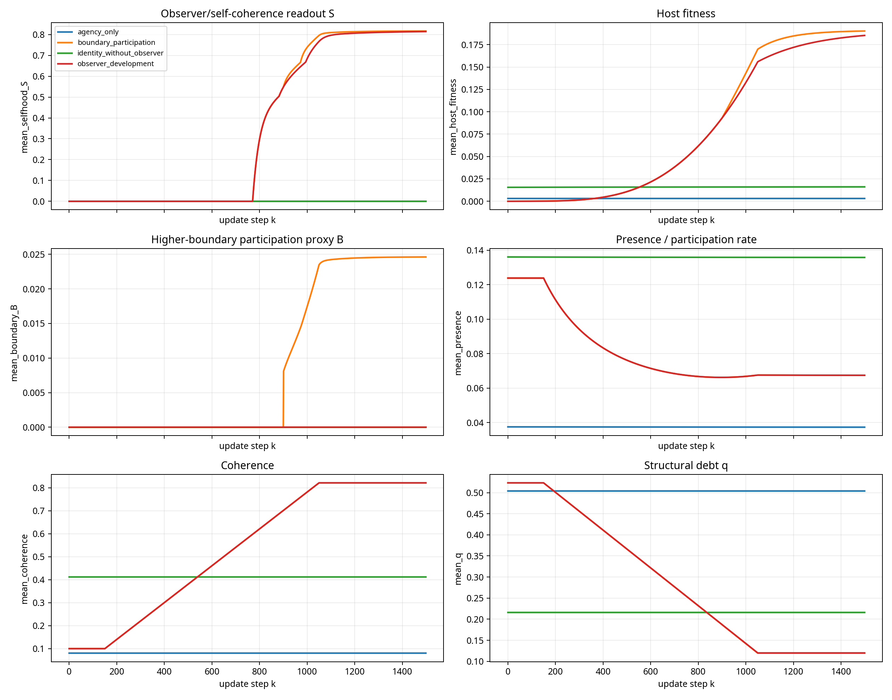
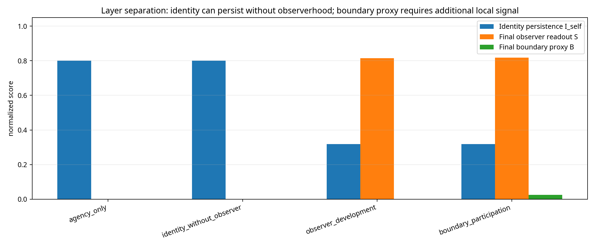

# Beyond Consciousness in DET v7: A Scientific Deep Dive into Agency, Identity, Observerhood, and Higher Boundary Participation

**Author:** Manus AI  
**Date:** May 30, 2026  
**Repository branch:** `det-v7-refactor`  
**Status:** Formal review and extension analysis; not a canonical-law replacement

## Abstract

The attached paper, **“Beyond Consciousness: Identity, Presence, and Higher Boundary Participation in Deep Existence Theory,”** proposes a layered structure in which **agency** is primitive, **identity** is regime persistence, **observerhood** is a coherent boundary-level readout, and **spirit** is participation in a higher boundary. This deep dive translates that proposal into DET v7’s operational language: local variables, derived readouts, simulation criteria, engineering applications, and falsifiers. The strongest scientific contribution of the paper is that it avoids equating agency with consciousness. A node or regime may participate in lawful updates without being an observer, and a regime may preserve identity without possessing selfhood. The speculative theological terms can remain meaningful, but only if they are treated as interpretive and hypothesis-generating language, while DET claims remain tied to local update laws, measurable thresholds, and falsifiable predictions.

The analysis supports developing the paper further. The proposed layer hierarchy is compatible with DET v7 if it is framed as a **derived diagnostic hierarchy** over canonical DET variables rather than as a replacement for the canonical update loop. The accompanying exploratory simulation suite demonstrates layer separation: agency can remain high while observerhood remains absent; identity can persist without observerhood; observerhood can emerge later after host-fitness thresholds are crossed; and higher-boundary participation requires an additional lawful boundary-compatible signal rather than automatically following from selfhood.

## 1. Scope and formal stance

This review keeps the paper’s religious and scriptural references within view, but treats them formally and scientifically. Scriptural references are not used as empirical evidence for DET. They are treated as interpretive correspondences that can suggest mathematical hypotheses about presence, coherence, non-coercive alignment, forgiveness/repair, healing, and boundary participation. The scientific test remains whether those hypotheses can be expressed through DET variables, local update rules, simulations, engineering analogues, and falsifiers.

The central stance is therefore conservative. The paper should not be presented as a modification of the canonical DET v7 update laws. It should be presented as a proposed interpretive and diagnostic hierarchy over the canonical model. This distinction protects DET v7’s **Agency-First** principle, strict locality, and use of mutable structural debt `q` while permitting a serious extension into observerhood and higher-boundary participation.

> **Recommended framing:** “This paper does not modify the canonical DET v7 update laws. It proposes a derived interpretive and diagnostic hierarchy over canonical variables, with observerhood and higher-boundary participation treated as extension hypotheses subject to falsification.”

## 2. Canonical DET grounding

DET v7 treats agency as primitive local participation capacity and treats presence as the effective rate at which that agency participates in an update. In the v7 formalism, a node can retain agency while its effective participation is slowed by load, structural debt, or coherence conditions. This is essential for the attached paper because it gives mathematical content to the statement that **agency and consciousness are not identical**.

Let the substrate be a local graph \(G=(V,E)\). At update index \(k\), a node \(i\in V\) carries canonical variables such as

\[
x_i(k)=\{F_i,q_i,a_i,\sigma_i,H_i,P_i,\Delta\tau_i,C_i\}.
\]

DET v7’s presence relation can be written as

\[
P_i = \left(a_i\sigma_i\frac{1}{1+F_i}\frac{1}{1+H_i}\frac{1}{\gamma_v}\right)D_i,
\qquad
D_i=\frac{1}{1+\lambda_Pq_i},
\qquad
\Delta\tau_i=P_i\Delta k.
\]

This relation makes presence operational. Presence is not merely psychological attention; it is the local effective rate at which agency can participate in the next update. The past can influence present participation through records, debt, coherence, and boundary conditions, but it cannot act except through the current update.

| Paper term | DET interpretation | Proposed status |
|---|---|---|
| Agency | Primitive capacity to participate in local updates, represented by \(a_i\). | Canonical DET v7 concept. |
| Presence | Effective participation rate, represented by \(P_i\) and \(\Delta\tau_i\). | Canonical DET v7 concept. |
| Identity | Persistence of a regime signature through time. | Derived metric over canonical and experimental variables. |
| Observer | Boundary-level self-coherence supported by host fitness, reciprocity, pointer stability, and maturity. | Experimental readout, not canonical law. |
| Spirit / higher-boundary participation | Lawful participation in a wider coherence/recovery boundary without agency override. | Speculative readout or optional extension hypothesis. |

## 3. Mathematical formalization of the layer hierarchy

### 3.1 Agency

The paper defines agency as the capacity to participate in local updates. This maps directly to DET v7’s primitive agency field \(a_i\in[0,1]\). The Agency-First principle requires that no accumulated history variable directly deletes agency. Instead, structural history affects the expression of agency through effective participation:

\[
\frac{\partial a_i(k)}{\partial q_i(k)}\bigg|_{direct}=0,
\qquad
\frac{\partial \Delta\tau_i(k)}{\partial q_i(k)}<0\quad\text{when}\quad \lambda_P>0.
\]

This gives the paper a clean scientific position. A rock, molecule, cell, robot, or person may participate in lawful updates, but participation alone does not imply self-awareness.

### 3.2 Identity

The paper defines identity as the persistence of a regime through time. This should be formalized as a similarity functional over time-separated regime signatures. For a local regime \(\Omega\subset V\), define

\[
\mathcal{R}_{\Omega}(k)=\left(q_{\Omega}(k), C_{E,\Omega}(k), C_{S,\Omega}(k), M^{ptr}_{\Omega}(k), S_{\Omega}(k)\right),
\]

where \(M^{ptr}\) is a pointer or record-stability proxy and \(S\) is a speculative self-coherence readout when present. A generalized identity metric is

\[
I_{\Omega}(k_1,k_2)=\sum_m w_m\,\mathrm{Sim}_m\left(\mathcal{R}_{\Omega,m}(k_1),\mathcal{R}_{\Omega,m}(k_2)\right),
\qquad \sum_m w_m=1,
\qquad I_{\Omega}\in[0,1].
\]

A regime has persistent identity over an interval if

\[
I_{\Omega}(k_1,k_2)\ge \Theta_I.
\]

This is important because identity becomes a measurable continuity relation, not a declaration of essence or personhood. A molecule, organism, institution, or digital twin can preserve identity in this formal sense without becoming an observer.

### 3.3 Observerhood

The paper says consciousness may emerge when a regime becomes sufficiently coherent to observe itself as a unified whole. DET should sharpen “sufficiently coherent” into thresholded readouts. The existing selfhood patch provides a plausible candidate. Define neighborhood averages \(\bar a_i,\bar P_i,\bar C_i,\bar q_i\), reciprocity \(R_i\in[0,1]\), and pointer stability \(M^{ptr}_i\). Host fitness can be expressed as

\[
H^{host}_i = \mathrm{clip}\left[
\bar a_i^{w_a}\bar P_i^{w_P}\bar C_i^{w_C}(1-\bar q_i)^{w_q}R_i^{w_R}(M^{ptr}_i)^{w_M},0,1
\right].
\]

If developmental maturity is included,

\[
D^{mature,+}_i=\mathrm{clip}\left[D^{mature}_i+\mu_D\bar C_iR_i(1-D^{mature}_i)-\lambda_D(1-\bar P_i)D^{mature}_i,0,1\right].
\]

A self-coherence occupancy field \(S_i\) can then be updated as a readout-first diagnostic:

\[
S_i^+=\mathrm{clip}\left[
S_i+\mu_S\,\sigma_k(H^{host}_i-\Theta_H)(1-S_i)-\lambda_S(1-\bar C_i)S_i-\chi_S\bar q_iS_i,0,1
\right].
\]

This model permits a scientific version of the paper’s observer claim. Agency may exist first, identity may persist next, and observerhood may arise only when agency, presence, coherence, low structural burden, reciprocity, pointer stability, and developmental conditions jointly support stable self-coherence.

### 3.4 Higher-boundary participation

The paper uses “Spirit” to name participation in a higher boundary. In a formal DET setting, this should not become a hidden nonlocal force or a direct agency override. A conservative definition is:

> **Higher-boundary participation** is a derived alignment regime in which an observer-level coherent identity is locally receptive to boundary-mediated coherence, recovery, and relational stabilization without violating strict locality or Agency-First invariance.

Let \(B_i\in[0,1]\) denote a readout of higher-boundary participation. A minimal readout-only form is

\[
B_i = S_i^{u_S}\bar C_i^{u_C}R_i^{u_R}(M^{ptr}_i)^{u_M}(1-\bar q_i)^{u_q}\,\Psi_i,
\]

where

\[
\Psi_i = \mathrm{clip}\left(\omega_G\hat G_i+\omega_J\hat J_i+\omega_H\hat H_i,0,1\right),
\]

and \(\hat G_i,\hat J_i,\hat H_i\) are normalized local histories of declared boundary-operator effects such as grace, jubilee, or healing. The crucial constraint is

\[
\frac{\partial a_i}{\partial B_i}\bigg|_{direct}=0.
\]

If boundary participation affects a system, it should do so through lawful local fields such as coherence \(C\), structural burden \(q\), tension \(F\), recovery channels, or declared boundary operators, not by overriding agency.

## 4. Simulation suite and results

A new exploratory simulation script was added under `det_v7_0/experimental/selfhood/run_beyond_consciousness_deep_dive.py`. It generates quantitative outputs and plots in `det_v7_0/docs/beyond_consciousness_simulations/`. The simulation is intentionally modest: it is not a proof of consciousness or spirit. Its purpose is to test whether the paper’s proposed layers can be separated in a DET-native way.

The simulation compares four scenarios. The first maintains high primitive agency but low coherence and high debt. The second preserves identity-like continuity while suppressing observer emergence. The third allows developmental host-fitness to cross an observer threshold. The fourth adds a local recovery/healing analogue after observer maturity, making a boundary-participation proxy possible.

| Scenario | Observer onset step | Boundary onset step | Identity persistence \(I_{self}\) | Final selfhood \(S\) | Final boundary proxy \(B\) | Interpretation |
|---|---:|---:|---:|---:|---:|---|
| `agency_only` | None | None | 0.800 | 0.000 | 0.000 | Agency can remain present without observerhood. |
| `identity_without_observer` | None | None | 0.800 | 0.000 | 0.000 | Identity can persist without self-aware observer readout. |
| `observer_development` | 783 | None | 0.319 | 0.814 | 0.000 | Observerhood emerges only after host-fitness and maturity conditions improve. |
| `boundary_participation` | 783 | None | 0.319 | 0.817 | 0.025 | Boundary proxy requires selfhood plus an additional local boundary-compatible signal. |

The key result is layer separation. The `agency_only` and `identity_without_observer` cases remain observer-negative, despite persistent agency or identity. The `observer_development` case shows delayed selfhood onset at step 783, supporting the claim that observerhood is a thresholded emergent readout rather than a synonym for primitive agency. The `boundary_participation` case produces only a small boundary proxy, and only when an additional declared recovery/healing analogue is active. This is scientifically useful because it prevents “spirit” from becoming an automatic synonym for consciousness.

## 5. Practical engineering applications

The paper becomes more useful when its metaphysical vocabulary is translated into instrumentable engineering variables. Current engineering literature already supports related themes. Digital twins are used as real-time virtual representations synchronized with physical systems through sensor data, enabling monitoring, predictive simulation, and decision support.[1] Active digital twins add closed-loop perception-action, active information seeking, and resilience-oriented maintenance.[2] Cyber-physical resilience work explicitly connects digital twins with self-monitoring, self-diagnosis, self-healing, trustworthy autonomy, and MAPE-K feedback loops.[1] Model-Based Systems Engineering and hardware/software-in-the-loop workflows already show how descriptive models can be synchronized with real-world autonomous systems and refined from live data.[3] Resilience engineering further emphasizes that autonomous systems are self-sufficient only within design boundaries and require anticipation, monitoring, control, recovery, learning, self-monitoring, and resource-context coupling.[4]

DET can contribute a compact diagnostic vocabulary for these systems. The central move is to separate actuation capacity from identity continuity, observer competence, and resource-context participation.

| DET layer | Engineering analogue | Candidate observable | Practical use |
|---|---|---|---|
| Agency | Actuation and update capacity | Actuator authority, compute access, energy availability, scheduler access | Determine whether a subsystem can participate in control updates. |
| Presence | Effective participation rate | Latency, duty cycle, throughput, clock drift, compute headroom | Detect degraded but non-dead participation channels. |
| Identity | Persistent regime continuity | State-estimator continuity, configuration lineage, model similarity, process invariants | Maintain digital-twin continuity and diagnose regime breaks. |
| Observer | Self-monitoring coherent model | Runtime assurance state, uncertainty estimate, anomaly diagnosis, MAPE-K state | Gate high-risk autonomous decisions. |
| Higher boundary participation | Resource-context coupling and lawful recovery | Interoperability, repair channels, failover resources, operator handoff, trusted services | Build non-isolated resilience and recovery pathways. |

### 5.1 Debt-aware digital twins

DET’s structural debt \(q\) can model accumulated degradation, deferred maintenance, residual stress, calibration drift, software entropy, cyber-risk debt, or operational fatigue. A DET-style digital twin would track

\[
X_{DET}=\{a,P,q,C,I_{\Omega},H^{host},S,B\}
\]

as live observables. The purpose is not to label the system conscious. The purpose is to distinguish a system that can still actuate from a system whose participation is slowed by structural burden. This is directly relevant to bridges, vehicles, industrial robots, power systems, and cloud infrastructure.

### 5.2 Observer-competence gating for autonomy

A robot may have functioning motors and compute while losing reliable self-monitoring under sensor dropout, calibration drift, or adversarial perturbation. DET suggests a controller should gate high-risk action using observer-competence criteria:

\[
\text{Allow high-risk action only if } H^{host}>\Theta_H,\quad S>\Theta_S,\quad I_\Omega>\Theta_I.
\]

This does not anthropomorphize the system. It treats observerhood as an assurance readout for stable self-model competence.

### 5.3 MBSE and hardware-in-the-loop validation

DET metrics can be inserted into MBSE, Software-in-the-Loop, and Hardware-in-the-Loop workflows as derived assurance variables. The resulting certification question is not “Is this system conscious?” but “Does this system preserve identity, presence, and observer-competence across perturbation, repair, and update?”

| Test variable | DET metric | Certification question |
|---|---|---|
| Sensor dropout | \(P\), \(H^{host}\), \(S\) | Does observer competence degrade before unsafe decisions occur? |
| Wear or thermal stress | \(q\), \(\Delta\tau\), \(C\) | Does structural debt predict participation slowdown? |
| Software update | \(I_\Omega\) | Does controlled identity persist across configuration change? |
| Recovery or repair | \(q\downarrow\), \(C\uparrow\), \(B\) proxy | Does recovery occur through lawful local channels rather than hidden override? |

### 5.4 Human-machine teaming and higher-boundary participation

The paper’s “Spirit” language can be operationalized in engineering as participation in a wider resource and recovery boundary: operator supervision, institutional support, cloud services, repair crews, shared standards, emergency protocols, and interoperable resource networks. Resilience engineering’s claim that “no robot is an island” maps directly onto DET boundary participation.[4]

| Domain | Higher-boundary channel | DET interpretation |
|---|---|---|
| Autonomous vehicles | Remote handoff, V2X communication, fleet map updates | Boundary-mediated context and recovery. |
| Smart grids | Islanding/reconnection, black-start support, grid-forming coordination | Local agency participating in larger coherence. |
| Industrial robotics | Maintenance crews, safety PLCs, spare-parts logistics | External resources restoring coherence without coercing local actuation. |
| Healthcare devices | Clinician oversight, EHR integration, alarms | Observer state embedded in accountable boundary context. |
| Cloud systems | SRE runbooks, failover regions, self-healing orchestration | Local recovery pathways resembling repair/jubilee analogues. |

## 6. Formal scientific critique of the attached paper

The paper’s strengths should be preserved. Its most important move is the separation of agency, identity, observerhood, and spirit. Its second strength is the elevation of presence from a psychological technique to the operational location of active participation. Its third strength is its non-coercive account of Spirit as coherence-producing rather than agency-overriding.

The paper’s weaknesses are mostly under-specification problems. It needs explicit equations, canonical-versus-speculative boundaries, threshold criteria, and falsifiers. It should not allow “Spirit” to function as an undefined nonlocal force, and it should not imply that all persistent identities have equal observerhood, personhood, or moral status.

| Area | Current weakness | Strengthening step |
|---|---|---|
| Canonical boundary | The draft does not clearly separate DET law from speculative extension. | State that the hierarchy is derived and diagnostic, not canonical-law replacement. |
| Spirit | Risk of becoming a hidden causal insertion. | Define as readout or local boundary participation with no direct agency writes. |
| Observerhood | “Sufficient coherence” is not quantified. | Use \(H^{host}\), \(S\), maturity, reciprocity, pointer stability, and thresholds. |
| Identity | Could be confused with personhood or value. | Define identity as regime persistence only. |
| Presence | Strong claim but initially verbal. | Ground directly in \(P_i\), \(\Delta\tau_i\), and the record-versus-update distinction. |
| Scriptural references | Could be read as evidence rather than interpretation. | Treat as hypothesis-generating correspondences; require equations and tests for DET claims. |

## 7. Recommended revisions to the paper

The revised paper should begin by stating that it is a formal DET v7 extension analysis. It should then introduce the layer hierarchy as a set of derived criteria rather than as metaphysical assertions. The scriptural section can remain, but it should be placed after the mathematical framework and should be framed as interpretive correspondence.

| Revised section | Scientific purpose | Recommended addition |
|---|---|---|
| Abstract | State the hypothesis and scope. | Add “derived readout hierarchy” and “not a canonical-law replacement.” |
| Agency and Presence | Ground primitive participation and active update. | Add \(a_i\), \(P_i\), \(\Delta\tau_i\), and \(q_i\). |
| Identity | Define persistence. | Add \(I_\Omega(k_1,k_2)\) and thresholds. |
| Observer | Define self-coherence emergence. | Add host fitness, maturity, reciprocity, pointer stability, and falsifiers. |
| Higher Boundary Participation | Preserve theological intent while avoiding hidden force. | Add \(B_i\), no-direct-agency-write constraint, and local operator channels. |
| Presence and Kingdom | Translate devotional language into participation language. | Treat “kingdom now” as a hypothesis about present update participation and coherence. |
| Applications | Demonstrate scientific utility. | Add digital twins, resilient autonomy, MBSE/HIL, and self-healing systems. |
| Falsifiers | Protect credibility. | Add tests that can fail the model. |

## 8. Falsifiers and experimental agenda

A scientific DET extension must be able to fail. The following falsifiers are recommended for the next paper version.

| Claim | Falsifier | Immediate test path |
|---|---|---|
| Agency is not consciousness. | High agency with low coherence/reciprocity must not produce observer readout. | Keep `agency_only` observer-negative. |
| Identity is not observerhood. | Persistent regime identity can remain observer-negative. | Keep `identity_without_observer` selfhood-negative. |
| Observerhood is emergent. | Selfhood should not appear immediately merely because agency exists. | Require delayed onset after host-fitness/maturity thresholds. |
| Spirit is not coercion. | Boundary participation must not directly overwrite agency. | Enforce \(\partial a_i/\partial B_i|_{direct}=0\). |
| Presence is operational. | \(q\), \(F\), \(C\), and \(P\) should predict effective participation better than identity labels alone. | Compare performance of DET variables against baseline digital-twin metrics. |
| Higher-boundary participation is localizable. | Boundary proxy should disappear if local recovery/coherence channels are removed. | Ablate healing/jubilee/grace analogues in simulations. |

The next experimental step should be a parameter sweep rather than a single illustrative run. The sweep should vary \(q\), coherence, maturity rate, reciprocity, pointer stability, and repair-channel strength. A stronger result would show phase transitions: ranges where agency persists, identity persists, observerhood appears, and boundary participation becomes possible.

## 9. Conclusion

The attached paper is worth developing because it identifies a real conceptual distinction that DET v7 can formalize: **agency is not consciousness, identity is not observerhood, and higher-boundary participation is not coercive control**. The paper’s theological references can remain meaningful if they are disciplined by DET’s scientific constraints. The strongest version of the idea treats “Spirit” as a formal hypothesis about lawful participation in a higher coherence/recovery boundary, not as an undefined force outside the model.

The immediate path forward is clear. The paper should be revised around variables, thresholds, simulations, engineering applications, and falsifiers. The current exploratory simulations already support the core layered intuition. The engineering application space is also substantial: debt-aware digital twins, observer-competence gating, MBSE/HIL validation, resilient autonomy, self-healing systems, and human-machine resource-context design. In that form, the paper can serve as a rigorous DET bridge between physics-like local update theory, consciousness modeling, practical engineering, and formal theological interpretation.

## References

[1]: https://royalsocietypublishing.org/doi/10.1098/rsta.2020.0369 "Digital twins as run-time predictive models for the resilience of cyber-physical systems: a conceptual framework"
[2]: https://arxiv.org/html/2506.14453v1 "Active Digital Twins via Active Inference"
[3]: https://www.mdpi.com/2079-8954/13/2/73 "An Approach Integrating Model-Based Systems Engineering, IoT, and Digital Twin for the Design of Electric Unmanned Autonomous Vehicles"
[4]: https://www.tandfonline.com/doi/full/10.1080/1463922X.2024.2401168 "No robot is an island - what properties should an autonomous system have in order to be resilient?"
