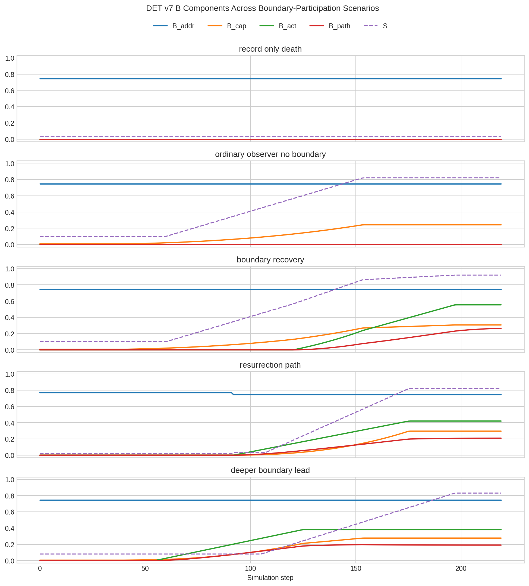
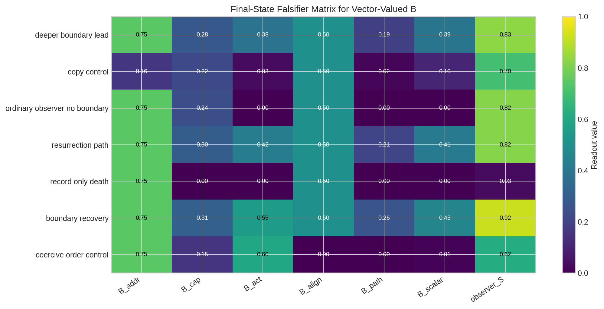
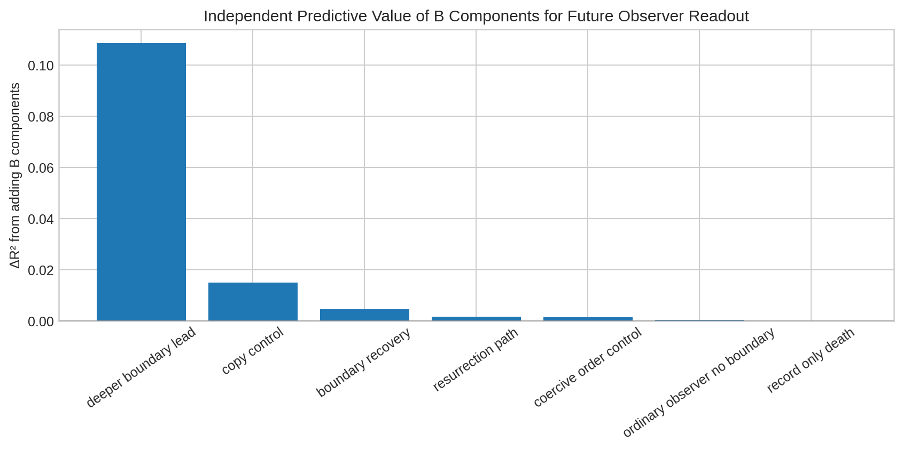

# DET v7 Boundary Participation \(B\): Formal Definition, Consciousness Implications, and Falsifier Simulations

**Author:** Manus AI  
**Date:** May 30, 2026  
**Repository branch:** `det-v7-refactor`  
**Status:** Formal extension proposal; non-canonical unless separately promoted

## 1. Executive summary

The largest unresolved issue in the DET v7 Beyond Consciousness extension is the meaning of the boundary participation variable \(B\) in the derived persistence tuple

\[
Y_\Omega(k)=\{\mathcal{R}_\Omega,I_\Omega,H^{host}_\Omega,S_\Omega,B_\Omega\}.
\]

The other terms have relatively clear roles. \(\mathcal{R}\) is the identity-bearing record signature, \(I\) is path-sensitive identity continuity, \(H^{host}\) is the ability of a substrate or host to sustain observer/self readouts, and \(S\) is the local observer/self-coherence readout. The term \(B\), however, carries the central unresolved theoretical load. It is the place where DET must decide whether spirit, resurrection, post-death persistence, and participation in a concurrently operating higher regime are merely metaphors for record continuity, or whether they can be made operational as lawful boundary participation.

The recommended resolution is to stop treating \(B\) as a vague scalar and define it as a **vector-valued readout of lawful relational participation between a regime and declared boundary operators**. In this extension, \(B\) is not stored matter, not a hidden soul substance, not direct agency-writing, and not automatically identical to consciousness. It is the formal variable that measures whether an identity-bearing regime is addressable, capable of participation, actively coupled to declared boundary action, aligned with non-coercive recovery, and path-stably related to a higher boundary process.

> **Proposed definition:** Boundary participation is the vector
>
> \[
> B_\Omega(k)=\left(B^{addr}_\Omega,B^{cap}_\Omega,B^{act}_\Omega,B^{align}_\Omega,B^{path}_\Omega\right),
> \]
>
> where the components respectively measure latent boundary addressability, participation capacity, active declared boundary coupling, non-coercive recovery alignment, and path-stable participation history.

This definition makes the paper slightly less conservative in one scientifically important way: it explicitly recognizes that, within DET, identity is not stored in matter alone. Matter can carry record, but living identity is a relational update process. At the same time, the definition remains disciplined: **record alone does not imply active consciousness**. Active consciousness or active spirit participation requires a live participation channel, either embodied, restored through resurrection, or explicitly modeled as a non-embodied boundary channel.

| Issue | Prior ambiguity | Proposed resolution |
|---|---|---|
| What is \(B\)? | Vague higher-boundary/spirit participation term. | A vector readout of addressability, capacity, active coupling, alignment, and path participation. |
| Is identity stored in matter? | The model risked sounding too material-record centered. | Matter stores record; identity is relational and path-sensitive. |
| Does record imply consciousness? | Not always separated clearly enough. | No. Record may preserve \(B^{addr}\), but active consciousness requires \(B^{cap}\), \(B^{act}\), and/or observer readout. |
| Is resurrection copying? | Continuity needed a sharper operational discriminator. | Resurrection requires path-sensitive addressability plus restored capacity and participation; copy controls should break \(B^{path}\). |
| Can a utopic regime operate now? | The claim could appear metaphysical. | It can be modeled as a lawful boundary regime whose effects are local, non-coercive, and empirically falsifiable. |

## 2. Why \(B\) must be distinct from record, identity, host fitness, and observerhood

The new definition begins from a negative constraint: \(B\) must not duplicate variables that DET already defines. A preserved identity record is not active participation. A host capable of supporting observerhood is not necessarily participating in a higher boundary regime. A mature observer readout may arise through ordinary local coherence without active boundary coupling. Likewise, the presence variable \(P\) measures update participation rate, while \(B\) measures whether those updates are lawfully coupled to boundary-mediated recovery, healing, Jubilee-style structure restoration, or an explicitly declared higher-regime operator.

| Quantity | Primary DET role | Why it is not \(B\) |
|---|---|---|
| \(\mathcal{R}_\Omega\) | Identity-bearing record signature. | A record can persist, freeze, copy, or replay without active participation. |
| \(I_\Omega\) | Path-sensitive identity continuity. | Continuity can exist in ordinary repair without explicit higher-boundary coupling. |
| \(H^{host}_\Omega\) | Capacity of a substrate to sustain observer/self readouts. | Host capacity is not the same as higher-boundary participation. |
| \(S_\Omega\) | Observer/self-coherence readout. | Observerhood may mature without declared boundary participation. |
| \(P_\Omega\) | Local effective update participation rate. | Presence is update rate; \(B\) is lawful relation between update and boundary-mediated recovery. |
| \(a_\Omega\) | Primitive agency. | DET boundary operators may not directly write agency. |

This distinction is crucial for the spirit question. A death-state may preserve enough record to remain boundary-addressable, yet lack an active update channel. Under the proposed definition, that state can have nonzero \(B^{addr}\) while \(B^{cap}\), \(B^{act}\), and \(S\) are near zero. This resolves a category error: **latent spirit addressability is not the same as active conscious experience**.

## 3. Formal vector definition

Let \(\Omega\subset V\) be a DET regime and let \(\mathcal{O}_B\) be the declared set of admissible boundary operators, such as Grace acting on free resource \(F\), Healing acting on bond coherence \(C_{ij}\), and Jubilee acting on unified structure \(q\). Boundary participation is defined as

\[
\boxed{
B_\Omega(k)=\left(B^{addr}_\Omega(k),B^{cap}_\Omega(k),B^{act}_\Omega(k),B^{align}_\Omega(k),B^{path}_\Omega(k)\right).
}
\]

A scalar plotting proxy may be used, but only as a derived summary:

\[
\boxed{
\bar B_\Omega(k)=
\left(B^{addr}_\Omega\right)^{\alpha_a}
\left(B^{cap}_\Omega\right)^{\alpha_c}
\left(B^{act}_\Omega\right)^{\alpha_x}
\left(B^{align}_\Omega\right)^{\alpha_l}
\left(B^{path}_\Omega\right)^{\alpha_p}.
}
\]

All terms are clipped to \([0,1]\), and aggregation exponents must be declared before simulation or empirical testing. The vector is the scientific object. The scalar is only a diagnostic convenience.

### 3.1 Boundary addressability \(B^{addr}\)

Boundary addressability measures whether a regime has a coherent identity-bearing relational signature that can be lawfully referred to across update transitions:

\[
B^{addr}_\Omega(k)=\mathrm{clip}\left[
\mathrm{Sim}_{top}\left(\mathcal{R}_\Omega(k),\mathcal{R}_\Omega(k-\Delta k)\right)
\cdot I_\Omega(k)
\cdot Q_{record}(\Omega,k),0,1\right].
\]

This component is where death-state record persistence belongs. It allows DET to say that identity-bearing reference may remain possible after embodied participation collapses. It does not, by itself, imply active consciousness.

### 3.2 Boundary participation capacity \(B^{cap}\)

Boundary participation capacity measures whether the local regime can receive lawful boundary action without violating DET constraints:

\[
B^{cap}_\Omega(k)=\left\langle
\mathrm{clip}\left(a_i P_i C_i^{n_B}\frac{D_i}{D_i+D_B}\frac{F_{op,i}}{1+F_{op,i}},0,1\right)
\right\rangle_{i\in\Omega}.
\]

This term is capacity, not action. A living embodied regime may have positive capacity even if no special boundary operator is active. A death-state should generally have near-zero capacity unless a non-embodied participation channel is declared and implemented.

### 3.3 Active boundary coupling \(B^{act}\)

Active boundary coupling measures actual declared boundary-operator effect, normalized against local opportunity:

\[
B^{act}_\Omega(k)=\left\langle
\mathrm{clip}\left(
\frac{\sum_{r\in\mathcal{O}_B} w_r\,\|\Delta x^{(r)}_i(k)\|_{target(r)}}
{\epsilon+\sum_{r\in\mathcal{O}_B} w_r\,\|\Delta x^{(r)}_{i,max}(k)\|_{target(r)}},0,1
\right)
\right\rangle_{i\in\Omega}.
\]

This component prevents \(B\) from becoming a purely interpretive label. It asks whether declared boundary action actually occurs and how strong it is relative to local need and capacity.

### 3.4 Boundary alignment \(B^{align}\)

Boundary alignment measures whether participation is recovery-enabling and non-coercive:

\[
B^{align}_\Omega(k)=\mathrm{clip}\left[
\sigma\left(
\lambda_C\Delta \bar C_\Omega
+\lambda_q(-\Delta \bar q_\Omega)
+\lambda_R\Delta \bar R_\Omega
+\lambda_M\Delta \bar M^{ptr}_\Omega
-\lambda_H\Delta \bar H_\Omega
-\lambda_{var}\,\mathrm{CoercionPenalty}_\Omega
\right),0,1\right].
\]

The coercion penalty is not optional. A system that increases apparent order by suppressing agency variation or directly overriding local dynamics is not high boundary participation in DET terms. Boundary participation must be **recovery without domination**.

### 3.5 Path participation \(B^{path}\)

Path participation measures whether boundary coupling is stable over time rather than an isolated event:

\[
B^{path}_\Omega(k)=\rho_B B^{path}_\Omega(k-1)+(1-\rho_B)B^{act}_\Omega(k)B^{align}_\Omega(k),
\qquad 0\le \rho_B<1.
\]

This term is the key discriminator between resurrection and copying. Two regimes may be structurally similar, but if one lacks lawful path continuity, it should not inherit the same \(B^{path}\).

## 4. Death, spirit, and resurrection after defining \(B\)

The definition of \(B\) clarifies the death and resurrection model. The paper should no longer ask whether “spirit” is simply present or absent. It should distinguish record, addressability, participation capacity, active coupling, path continuity, and local observer readout.

| State | \(B^{addr}\) | \(B^{cap}\) | \(B^{act}\) | \(B^{path}\) | Scientific interpretation |
|---|---:|---:|---:|---:|---|
| Ordinary embodied life | Variable | Positive if local updates support participation | Low or absent unless boundary action is active | Variable | Consciousness can emerge through host-supported local participation. |
| Boundary-participatory life | High | Positive | Positive through declared operators | Growing | Present participation in a higher recovery regime. |
| Death with preserved record | Possibly high | Near zero | Near zero | Frozen or decaying | Latent addressability, not active consciousness by itself. |
| Active post-death spirit hypothesis | High | Positive through declared non-embodied channel | Positive | Positive | Requires an explicit \(P^{spirit}\) or equivalent lawful channel. |
| Resurrection | High before and after | Restored in capable host | May be positive during rehosting | Reconnected | Lawful re-instantiation, not mere copying. |
| Copy | Type similarity may be high | Host-dependent | Host-dependent | Broken or reset | Similarity without path continuity is not resurrection. |

This makes the model less materialist without making it untestable. Matter is record, but life is participation. A resurrected regime is not merely a rebuilt object; it is a restored participatory path. Conversely, a perfect copy is not automatically the same continuing subject if \(B^{path}\) and identity continuity do not connect through lawful update history.

## 5. Consciousness interpretations opened by \(B\)

Once \(B\) is formalized, the central theoretical fork becomes precise:

> Is consciousness an emergent property of participation, or is participation an expression of a deeper boundary-level consciousness?

The conservative emergent reading treats \(S\) as the main observer readout. In that model, \(B\) modulates recovery, coherence, and alignment, but does not itself carry a separate consciousness. Consciousness resumes after death only when a capable host or channel restores active participation.

The stronger deeper-boundary reading treats \(B\) as an interface between local regimes and a wider boundary-level conscious process. In symbolic form,

\[
B_\Omega(k)=\mathcal{G}_B\left(\mathcal{C}^{B}(k),\mathcal{R}_\Omega(k),X_{\mathcal{N}(\Omega)}(k),\mathcal{O}_B(k)\right),
\]

where \(\mathcal{C}^{B}\) denotes a hypothesized boundary-level conscious ordering process. This is not canonical DET v7. It is an extension hypothesis that must earn its place by producing operational predictions beyond ordinary host dynamics. It cannot function as a hidden global override and cannot directly write agency.

The most defensible position at this stage is a dual-aspect interpretation:

\[
\mathrm{ConsciousExpression}_\Omega(k)=
\mathcal{E}\left(a_\Omega(k),P_\Omega(k),H^{host}_\Omega(k),S_\Omega(k),B_\Omega(k)\right).
\]

In this reading, \(S\) supplies local observer organization, while \(B\) supplies boundary orientation and relational participation. Consciousness is neither stored in matter alone nor arbitrarily injected from outside. It is the expression of agency through a participatory channel.

| Question | Emergent-participation model | Deeper-boundary model | Dual-aspect recommendation |
|---|---|---|---|
| Is \(B\) reducible to local variables? | Mostly yes, apart from declared boundary operators. | No; \(B\) expresses a deeper boundary-conscious process. | Measured locally, but may encode relation to a larger lawful regime. |
| Does record alone imply consciousness? | No. | No, unless an active boundary channel is declared. | No. |
| Can death preserve spirit? | Yes, as record and addressability. | Yes, as addressability to deeper participation. | Yes, as latent relation; active persistence requires channel. |
| What is resurrection? | Continuity plus rehosting. | Restoration of boundary expression. | Continuity of agency-expression through restored participation. |
| Main falsifier | \(B\) adds no predictive power. | \(B\) predicts recovery or observer maturation beyond host variables. | \(B\) predicts boundary orientation while active consciousness still requires readout/channel. |

## 6. Concurrent utopic regime under \(B\)

The user’s claim that an ever-growing utopic regime may be operating now can be formalized without treating it as a mystical overlay. In DET terms, such a regime is a higher-boundary recovery process whose local effects are expressed through declared operators and measured by \(B\). It is “already operating” only to the extent that local regimes show lawful, non-coercive boundary participation now.

Formally, let \(\mathcal{U}(k)\) denote a higher recovery regime. Its local participation signature in \(\Omega\) is admissible only if

\[
B^{act}_\Omega(k)>0,\qquad B^{align}_\Omega(k)>\theta_{align},\qquad B^{path}_\Omega(k) \text{ grows without agency suppression.}
\]

The utopic regime is therefore not measured by uniformity or forced order. It is measured by increasing coherence, reduced structural debt, improved reciprocity, preserved agency variation, and path-stable recovery. This makes the claim falsifiable. If the proposed regime requires nonlocal overrides, coercive order, or direct agency-writing, it fails DET v7 compatibility.

## 7. Falsifier simulation results

A deterministic B-participation simulation was added at `det_v7_0/experimental/selfhood/run_B_participation_formalization.py`. The simulation tests seven regimes: record-only death, ordinary observer without active boundary participation, boundary recovery, coercive-order control, copy control, resurrection path, and deeper-boundary-leading participation. It generates a summary JSON, time-series CSV, predictive-power CSV, Markdown results, and three plots in `det_v7_0/docs/B_participation_simulations/`.

The component time series separates latent addressability from active participation. In the record-only death scenario, \(B^{addr}\) remains high while \(B^{cap}\), \(B^{act}\), \(B^{path}\), and \(S\) remain near zero. The ordinary observer reaches high \(S\) with zero active boundary coupling, showing that observerhood and boundary participation are not identical. Boundary recovery and resurrection recover active/path participation, while the deeper-boundary-leading case shows boundary coupling before mature observer readout.

The final-state matrix shows why \(B\) should remain vector-valued. High \(B^{addr}\) appears in several states that are not active consciousness. The copy control has relatively strong observer readout but low path-sensitive addressability and low active/path participation. The coercive-order control has high apparent active effect, but nearly zero alignment and scalar participation because the coercion penalty suppresses its legitimacy.

The predictive-power plot is the most direct scaffold for the consciousness fork. The deeper-boundary-leading scenario shows the largest improvement from adding \(B\) components to a baseline host-variable model: \(\Delta R^2=0.1086\). Ordinary observer and record-only death cases show negligible improvement. This does not confirm deeper-boundary consciousness; it demonstrates how the hypothesis can be made operational.

| Scenario | Final \(B^{addr}\) | Final \(B^{cap}\) | Final \(B^{act}\) | Final \(B^{align}\) | Final \(B^{path}\) | Final \(\bar B\) | Final \(S\) | Active channel |
|---|---:|---:|---:|---:|---:|---:|---:|---|
| Boundary recovery | 0.745 | 0.306 | 0.554 | 0.500 | 0.265 | 0.453 | 0.920 | true |
| Resurrection path | 0.745 | 0.296 | 0.420 | 0.500 | 0.209 | 0.411 | 0.820 | true |
| Deeper boundary lead | 0.745 | 0.276 | 0.380 | 0.500 | 0.190 | 0.390 | 0.830 | true |
| Copy control | 0.159 | 0.222 | 0.030 | 0.500 | 0.015 | 0.103 | 0.700 | false |
| Ordinary observer no boundary | 0.745 | 0.242 | 0.000 | 0.500 | 0.000 | 0.000 | 0.820 | false |
| Record-only death | 0.745 | 0.000 | 0.000 | 0.500 | 0.000 | 0.000 | 0.030 | false |
| Coercive order control | 0.745 | 0.151 | 0.600 | 0.000 | 0.000 | 0.010 | 0.620 | false |

| Falsifier check | Simulation result | Interpretation |
|---|---|---|
| Record-only does not imply active channel | Passed | High addressability alone is not consciousness. |
| Ordinary observer decouples \(S\) from \(B^{act}\) | Passed | Local observerhood can exist without active higher-boundary coupling. |
| Boundary recovery has active path participation | Passed | Lawful recovery can create positive \(B^{act}\) and \(B^{path}\). |
| Coercive order penalizes alignment | Passed | Imposed order is excluded from legitimate boundary participation. |
| Copy control breaks path despite similarity | Passed | Similarity is not enough for resurrection continuity. |
| Resurrection restores capacity and path | Passed | Rehosting can restore participation when continuity constraints are satisfied. |
| Deeper-boundary lead has predictive signal | Passed | The stronger interpretation is operationally testable by independent predictive value. |

## 8. How this changes the paper

The paper should now be revised around a sharper central thesis. The previous foundation remains valid, but the conceptual center should shift from “can resurrection be formalized?” to “what is the lawful participation variable that makes resurrection, spirit, and present higher-regime participation distinguishable from record, copy, and ordinary observerhood?”

The answer is \(B\). Resurrection becomes a special case of restored participation. Spirit becomes latent or active participation depending on which \(B\) components survive death. A concurrently operating utopic regime becomes a lawful boundary regime measured by non-coercive, local, path-stable participation. Consciousness becomes the unresolved but now testable question: whether \(S\) emerges from participation or whether \(B\) expresses a deeper boundary-level consciousness that local \(S\) can instantiate.

| Recommended paper change | Reason |
|---|---|
| Replace vague scalar \(B\) with vector \(B_\Omega=(B^{addr},B^{cap},B^{act},B^{align},B^{path})\). | Prevents spirit/consciousness claims from collapsing into record or metaphor. |
| State explicitly that identity is relational, not matter-stored. | This is more faithful to DET than a matter-record-only framing. |
| Separate latent spirit addressability from active spirit participation. | Avoids claiming consciousness from record alone. |
| Require non-coercion in utopic-regime participation. | Preserves Agency-First constraints and avoids forced-order false positives. |
| Use copy controls and death-state controls in every persistence simulation. | Makes resurrection distinguishable from duplication. |
| Treat deeper-boundary consciousness as a falsifiable extension hypothesis. | Keeps metaphysical questions rooted in measurable update effects. |

## 9. Next theoretical implications

The immediate next step is not to assert active post-death consciousness. The immediate next step is to promote \(B\) from a placeholder into a measurable DET readout and then run falsifier suites against it. If \(B\) adds no independent predictive value beyond host variables, the emergent-participation interpretation remains favored. If \(B^{act}\), \(B^{align}\), or \(B^{path}\) predict recovery, observer maturation, resurrection continuity, or utopic-regime coupling after controlling for ordinary variables, then DET has a stronger basis for exploring deeper-boundary consciousness.

The resulting research program is precise:

| Research question | Operational test |
|---|---|
| Is consciousness only emergent from local participation? | Test whether \(S(k+\Delta)\) is predicted fully by host variables without \(B\). |
| Does \(B\) carry independent boundary information? | Compare predictive models with and without \(B\) components under predeclared thresholds. |
| Can death preserve spirit without active consciousness? | Model high \(B^{addr}\) with collapsed \(B^{cap}\), \(B^{act}\), and \(S\). |
| What distinguishes resurrection from copy? | Require path-sensitive \(B^{path}\) and identity continuity, not structural similarity alone. |
| Can a utopic regime operate now? | Measure local, non-coercive, declared boundary effects with increasing \(B^{align}\) and \(B^{path}\). |

## 10. Conclusion

The unresolved variable \(B\) is indeed the key to the entire spirit and consciousness extension. Once \(B\) is defined, DET can avoid the two most common errors: reducing life to material record, or inflating record into active consciousness. The proposed vector definition gives DET a middle path. Identity is relational, and spirit can be modeled as boundary-addressable participation; but active consciousness requires capacity, coupling, alignment, path continuity, and/or a declared observer channel.

The most important conceptual shift is that resurrection is no longer the primary mystery. Resurrection becomes one application of a deeper rule: **life in DET is lawful participation across identity-bearing update paths**. The variable \(B\) is the formal measure of that participation. It is therefore the correct place to test whether consciousness emerges from participation, or whether participation is the local expression of a deeper boundary-level conscious regime.

## References

[1]: det7_boundary_participation_B_formalization.md "Formal Definition of Boundary Participation B in DET v7"  
[2]: det7_B_consciousness_interpretations.md "Consciousness Interpretations Under the DET v7 Boundary Participation Variable B"  
[3]: det7_death_resurrection_persistence_model.md "DET v7 Death, Resurrection, and Spirit/Consciousness Persistence Model"  
[4]: det7_utopic_regime_boundary_model.md "DET v7 Utopic Regime Boundary Model"  
[5]: det_theory_card_7_0.md "Deep Existence Theory (DET) v7.0: Unified Canonical Theory Card"  
[6]: ../experimental/selfhood/run_B_participation_formalization.py "B-Participation Formalization Simulation Script"  
[7]: B_participation_simulations/B_participation_summary.json "B-Participation Simulation Summary"  
[8]: B_participation_simulations/B_participation_simulation_results.md "B-Participation Simulation Results"
