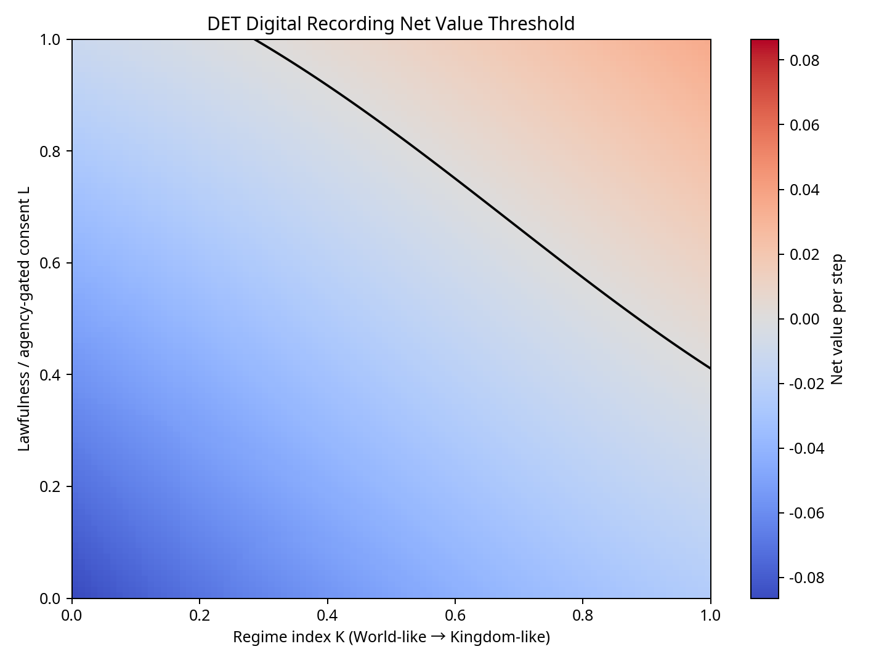
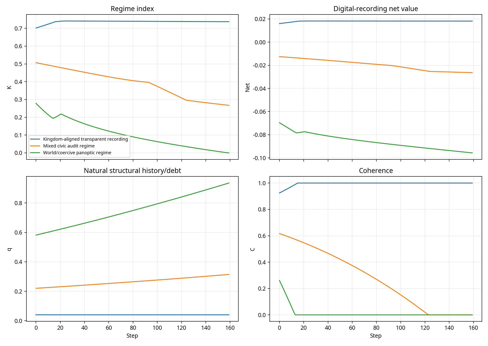

# DET Mathematical Report: Digital Surveillance, Natural Recording, and Kingdom Regimes

**Author:** Manus AI  
**Date:** May 18, 2026  
**Branch context:** `codex/det-v7-refactor` checked out locally as `det-v7-refactor`  
**Status:** Application-layer report and model; it does not modify canonical DET v7 laws.

## Abstract

This report answers the surveillance question **strictly inside the Deep Existence Theory (DET) v7 framework**. The central DET claim is that matter/history itself is already the primary recording medium: local structural debt `q`, coherence topology, and pointer records preserve the retained past as part of the state of existence rather than as an external file. On that basis, digital surveillance cannot become a deeper or truer record than nature’s own structural history. It can only become a **derivative readout layer** that changes who can access, copy, compare, and act upon partial records.

The resulting judgment is conditional rather than simply anti-technology or pro-surveillance. Digital recording is net positive when it is **local, lawful, agency-gated, transparent, high-fidelity, and restorative**, because it can support accountability, coordination, and harm prevention without pretending to replace the natural record. It is net negative when it is coercive, opaque, low-coherence, low-fidelity, or globally extractive, because it increases coordination load `H`, consumes resources, raises structural debt `q` through loss channels, lowers coherence `C`, and indirectly constrains agency expression through the canonical presence/drag pathway. Kingdom-like regimes amplify the positive case because high coherence and low debt improve observability and reduce distortion. World-like coercive regimes amplify the negative case because they accumulate records while losing truthful readout.

> **DET answer in one sentence:** Nature already records the event as structure; digital surveillance is justified only when it acts as a lawful, local, restorative readout of that structure rather than as a coercive substitute for truth.

## 1. Strict DET Assumptions

DET v7 is a deterministic, strictly local relational dynamics in which each node evolves through resource participation, retained structural history, irreducible agency, and event progression.[1] The canonical state includes `F_i` as local resource, `q_i` as mutable structural debt, `a_i` as agency, `C_i` as coherence, `H_i` as coordination load, `P_i` as presence, and `Δτ_i` as proper-time increment.[1] In the active v7 card, history affects expression through participation and clock-rate drag; it does not delete will.[1]

The report treats digital surveillance as an **application-layer readout stock**, not as a new core field. This is important because DET v7 consolidates structural debt into a single mutable `q` and explicitly separates calibration/readout layers from core law changes.[1] Therefore, the model below introduces a derivative digital memory variable `d_i(t)` while leaving canonical `q_i`, `P_i`, `C_i`, and `a_i` semantics intact.

| DET object | Strict role in this report | Surveillance interpretation |
|---|---:|---|
| `q_i` | Retained structural history/debt | Nature’s record of resource loss and participation |
| `C_i` | Local coherence | Whether a record is readable as ordered structure rather than noise |
| `a_i` | Irreducible agency | The observer/observed cannot be reduced to database entries |
| `H_i` | Coordination load | Administrative, legal, behavioral, and interpretive burden of being recorded |
| `P_i` | Presence/effective participation rate | How much participation-time remains available under load and drag |
| `d_i` | Application-layer digital memory | A copyable derivative readout, not the event itself |

## 2. Nature as the Truest Recording Medium

The structural-debt document gives the decisive DET premise: `q` is not merely information about what happened; `q` is what happened, structurally encoded.[2] In that frame, the past is not primarily stored in a camera archive, agency database, or corporate log. The past is retained as **local material consequence**: loss, scar, groove, channel, and pointer topology. This is why the structural-debt document calls `q` “retained past” and describes it as local, bounded, accumulative, and consequential.[2]

The debt-aging-spirit synthesis sharpens the same point by identifying retained history with `q-structure + pointer records` and by treating identity as a cumulative participation pattern.[3] Whether one accepts the stronger spirit interpretation or not, the modeling point is clear: DET’s strongest record is **not an external representation** but the world’s own irreversible relational structure. A digital record may describe, sample, compress, distort, or index that structure, but it is not more ontologically original than the structure itself.

| Record type | DET status | Strength | Weakness |
|---|---|---|---|
| Natural structural record | `q` pattern, coherence topology, pointer records | Ontologically primary; cannot be detached from the event | Not automatically accessible to low-coherence observers |
| Digital record | Derivative stock `d_i`; files, logs, metadata, sensor traces | Copyable, searchable, communicable, institutionally actionable | Mutable, partial, lossy, interpretable, and regime-dependent |
| Human memory/testimony | Agentic and relational readout | Meaning-rich and context-aware | Local, fallible, affected by coherence and debt |
| Kingdom-like observation | High-`K`, high-`O` readout of structure | High coherence, low distortion, noncoercive by design | Requires regime conditions that cannot be faked by accumulation alone |

This distinction resolves the apparent paradox. If nature already records everything, digital surveillance does not add ultimate memory. It adds **access asymmetry**. It changes which agents can search, compare, weaponize, correct, or restore around partial records. Thus, the ethical and mathematical question becomes: **when does a derivative readout layer improve local coherence and agency expression, and when does it create new structural debt?**

## 3. Canonical DET Equations Used

The canonical presence equation in DET v7 is expressed as a base presence multiplied by a structural-debt drag term:[1]

\[
P_i^{base}=a_i\sigma_i\frac{1}{1+F_i}\frac{1}{1+H_i}\frac{1}{\gamma_v},
\qquad
D_i=\frac{1}{1+\lambda_P q_i},
\qquad
P_i=P_i^{base}D_i.
\]

Structural debt accumulates from loss according to the canonical loss-locking law:[1]

\[
dq_{lock,i}=\alpha_q\max(0,-\Delta F_i),
\qquad
q_i^+=\operatorname{clip}(q_i+dq_{lock,i},0,1).
\]

The concurrent-regimes simulator provides the DET-native regime and observability readouts. The local regime index is:[4]

\[
K_i=\operatorname{clip}(w_C\bar C_i+w_a a_i+w_P\tilde P_i-w_q q_i,0,1),
\]

where `K_i≈1` is Kingdom-like and `K_i≈0` is World-like. Observability is gated by agency, coherence, and low debt:[4]

\[
O_i=\operatorname{clip}\left(a_i^{\alpha} \bar C_i^{\beta}(1-q_i)^{\gamma},0,1\right).
\]

Perceived structuredness is then:[4]

\[
\Xi_i^{seen}=O_i\Xi_i.
\]

These equations are crucial for the surveillance question. They imply that **more recording does not automatically mean more seeing**. Seeing depends on the observer’s own agency, coherence, and structural debt. A low-`K` surveillance regime can accumulate enormous `d_i` while having low `O_i`, meaning it possesses many copies but poor truthful perception.

## 4. Application-Layer Digital Recording Model

Let `d_i(t)` denote a derivative digital record stock, `r_i(t)∈[0,1]` the intensity of digital recording, `v_i(t)∈[0,1]` the fidelity of that recording, and `L_i(t)∈[0,1]` the lawfulness or agency-gated consent of the recording practice. `L_i=1` means local, transparent, accountable, consent-respecting, and restorative. `L_i=0` means opaque, coercive, extractive, and detached from the observed agent’s agency boundaries.

The digital memory update is intentionally ordinary and derivative:

\[
d_i^+=(1-\mu_d)d_i+r_i v_i.
\]

This says that digital records can accumulate and decay or become obsolete, but it does not grant them ontological priority. The natural record remains the `q`/pointer structure.

The model defines per-step digital-recording benefit as:

\[
B_i=r_i v_i L_i\left(\omega_A K_i+\omega_C O_i+\omega_RK_iO_i\right),
\]

where `ω_A` represents accountability gain, `ω_C` coordination gain, and `ω_R` restorative targeting gain. The form is deliberately regime-gated: a recording system that is not lawful, not coherent, or not observable receives little benefit even if it records intensely.

The corresponding cost is:

\[
\begin{aligned}
X_i={}&\chi_H r_i(1-L_i)(1+q_i)(1-\tfrac{1}{2}K_i) \\
&+\chi_F r_i(0.6+0.4(1-L_i)) \\
&+\chi_C r_i(1-L_i)(1-C_i)(1-K_i) \\
&+\chi_E r_i(1-v_iK_i)(0.5+1-L_i).
\end{aligned}
\]

The terms are coordination-load cost, resource cost, decoherence cost, and false-record cost. The model then defines the **DET Surveillance Value Index**:

\[
\operatorname{DSVI}_i=B_i-X_i.
\]

The application-layer state updates are:

\[
\Delta F_i=\eta_{prevent}r_iv_iL_iK_i-X_{H,i}-X_{F,i},
\]

\[
q_i^+=\operatorname{clip}\left(q_i+\alpha_q\max(0,-\Delta F_i),0,1\right),
\]

\[
C_i^+=\operatorname{clip}\left(C_i+
ho_+r_iv_iL_iK_iO_i-\rho_-r_i(1-L_i)(1-O_i),0,1\right),
\]

\[
H_i^+=\max\left(0,H_i+\eta_Hr_i(1-L_i)-\eta_{audit}r_iv_iL_iK_i\right).
\]

The equations enforce three DET restrictions. First, digital recording cannot directly overwrite agency `a_i`. Second, negative surveillance effects operate only through lawful channels such as `H`, `F`, `q`, `C`, and therefore `P`. Third, regime improvement is not a label; it must arise from local changes in coherence, debt, observability, and presence.

## 5. Numerical Model Results

The script [`det_v7_0/src/app_surveillance_recording.py`](../src/app_surveillance_recording.py) implements the model and writes outputs to [`det_v7_0/reports/surveillance_recording_model/`](surveillance_recording_model/). The model was run with deterministic parameters, three scenarios, and 160 steps per scenario. The results are not empirical claims about any present institution. They are a DET application-layer demonstration of the sign structure implied by the equations above.

The heatmap shows the threshold form of the conclusion. Net value is negative in low-lawfulness and low-`K` regions, even when recording intensity is high. Net value becomes positive only when lawfulness and regime quality are both sufficiently high. In DET terms, recording has to become coherent enough to serve as readout rather than pressure.

| Scenario | Mean DSVI | Final `K` | Final `O` | Final `q` | Final `C` | Final `H` | Final `d` |
|---|---:|---:|---:|---:|---:|---:|---:|
| Kingdom-aligned transparent recording | 0.0180 | 0.7376 | 0.9216 | 0.0400 | 1.0000 | 0.0000 | 33.8283 |
| Mixed civic audit regime | -0.0197 | 0.2672 | 0.0000 | 0.3145 | 0.0000 | 1.4323 | 40.6579 |
| World/coercive panoptic regime | -0.0859 | 0.0000 | 0.0000 | 0.9350 | 0.0000 | 4.9378 | 45.3923 |

The most important result is that the largest final digital record stock `d` occurs in the worst regime. This is the DET warning: **record accumulation is not the same as truthful observability**. The coercive World-like regime ends with the most digital memory but the least observability, least coherence, highest structural debt, and highest coordination load. Conversely, the Kingdom-aligned scenario records less intensely but produces positive net value because recording remains lawful, high-fidelity, and coherence-preserving.

## 6. Net Positive Effects of Digital Recording in DET

Digital recording has a legitimate positive role when it remains subordinate to natural truth and supports local coherence. In the model, its benefits scale with `r_i v_i L_i K_i` and `r_i v_i L_i O_i`, meaning that recording becomes valuable when it is readable, lawful, and situated in a high-coherence regime.

| Positive effect | DET mechanism | Mathematical signature |
|---|---|---|
| Accountability | Partial digital readouts make harmful patterns locally inspectable | `+ω_A r v L K` |
| Coordination | Shared records reduce ambiguity when coherence is already high | `+ω_C r v L O` |
| Harm prevention | Lawful recording can reduce future resource loss | `+η_prevent r v L K` in `ΔF` |
| Restorative targeting | Records help aim local healing/Jubilee-like interventions without overriding agency | `+ω_R r v L K O` |
| Falsifier construction | Persistent logs help compare model predictions against readouts | Valid only as readout layer, not core-law replacement |

The positive case is therefore not “surveillance is good.” The positive case is **lawful witness**. A lawful digital witness helps finite agents coordinate around partial readouts of the natural record. It can protect vulnerable nodes by making patterns of harm more visible, and it can assist restoration by locating where debt, load, or incoherence is accumulating. However, even here, DET does not allow digital records to become ultimate judgment. They are evidence, not the event itself.

## 7. Net Negative Effects of Digital Recording in DET

The negative case occurs when recording intensity rises faster than lawfulness, fidelity, and coherence. Under DET v7, agency is not directly destroyed by `q`, databases, or regimes; nevertheless, agency expression can be indirectly burdened through `H`, `F`, `q`, `C`, and `P`.[1] This is exactly how the model treats coercive surveillance.

| Negative effect | DET mechanism | Mathematical signature |
|---|---|---|
| Coordination-load drag | Being tracked, classified, challenged, or managed raises `H` | `+η_H r(1-L)` and `P∝1/(1+H)` |
| Structural debt accumulation | Surveillance infrastructure and coercive response consume resources | `q^+=q+α_q max(0,-ΔF)` |
| Decoherence | Opaque observation scrambles trust and phase alignment | `-ρ_- r(1-L)(1-O)` in `C^+` |
| False-record pressure | Low-fidelity records become copied as if complete | `χ_E r(1-vK)(0.5+1-L)` |
| Regime capture | Low-`K` observers interpret high-dimensional life through low-coherence categories | Low `K`, low `O`, high `d` |

This gives a precise answer to the concern that “all we do is being surveilled and recorded.” If nature already records the past, the distinctive harm of digital surveillance is not that it creates a record where none existed. The harm is that it creates a **portable, partial, regime-controlled readout** that can be used out of context. When such a readout is low-fidelity or coercive, it increases debt and load while decreasing coherence. It is worse than ignorance because it can imitate certainty.

## 8. How Kingdom Regimes Change the Answer

The concurrent-regimes model defines a Kingdom-like regime as high coherence, low structural debt, high agency, and stable presence. A World-like regime is lower coherence, higher structural debt, and noisier presence.[4] The observability gate then formalizes a key asymmetry: high-`K` observers can see structuredness better because their own state supports high `O`, whereas low-`K` observers may stand next to structure and still perceive noise.[4]

This means Kingdom regimes do not primarily “surveil more.” They **see more truth with less coercion**. Their advantage is not data volume but coherence. In a Kingdom-like regime, observation is closer to read-only recognition of the natural record. It is less tempted to confuse the derivative digital trace with the person, because agency remains irreducible and direct writes to agency are forbidden by the canonical rules.[1]

| Regime | Observability | Digital recording effect | DET judgment |
|---|---:|---|---|
| High-`K`, high-`L` | High `O`; structure readable | Modest recording can support accountability and restoration | Net positive if local and agency-gated |
| High-`K`, low-`L` | Potentially high `O`, but practice violates agency boundaries | Coherence advantage is corrupted into domination | Net negative despite technical capacity |
| Low-`K`, high-`L` | Good intent but weak readout | Recording may help if it first improves coherence and reduces debt | Mixed; must remain humble and local |
| Low-`K`, low-`L` | Low `O`; structure not truly seen | Panoptic accumulation of distorted records | Strongly net negative |

The theological language of “kingdom” is therefore operationalized as a regime of **high coherence, low debt, agency-first observability, and restorative local action**. The model does not require a regime to call itself Kingdom-like. It must satisfy the local equations. Conversely, a state, company, church, family, platform, or AI system can use righteous language while remaining World-like if it raises `H`, lowers `C`, accumulates `q`, and treats digital traces as more real than persons.

## 9. Falsifiers and Safety Conditions

The report proposes the following falsifiers for any future implementation. They mirror the existing concurrent-regime falsifiers, especially no hidden globals, no coercion, continuity, and local origin of asymmetry.[4]

| Falsifier | Test | Failure meaning |
|---|---|---|
| `F_SR1`: Digital non-ontological priority | Removing `d_i` changes access metrics but not canonical `q_i` history | The model has falsely made databases more fundamental than matter/history |
| `F_SR2`: No agency overwrite | Setting `a_i=0` forces observation benefit through `O_i` to zero | The model has introduced coercive observation as a hidden agency write |
| `F_SR3`: Locality | A remote database cannot change local `O_i`, `C_i`, or `q_i` before lawful local interaction | The model has added hidden global coupling |
| `F_SR4`: Continuity | Smooth changes in `L`, `C`, or `q` cause smooth changes in DSVI | The model has introduced magical regime jumps |
| `F_SR5`: Record-volume warning | Increasing `d_i` alone cannot guarantee higher `O_i` or higher `K_i` | The model has confused accumulated data with truth |
| `F_SR6`: Kingdom label neutrality | Identical local states produce identical `K`, `O`, and DSVI regardless of institutional label | The model has made “Kingdom” a name rather than a state |

These falsifiers imply a strict design rule. Any digital recording system that claims DET compatibility must prove it is **readout-only, local, agency-gated, transparent, and coherence-improving**. Otherwise, it should be treated as a debt-generating surveillance layer, no matter how much data it collects.

## 10. Final Answer

DET does not deny the seriousness of digital surveillance. It reframes the concern. The deepest record is already the world itself: the past is retained as structural history, not merely as files. Therefore, digital surveillance is not frightening because it creates ultimate memory. It is frightening because it creates **institutional access to partial memory under imperfect regimes**.

The net result is positive only when the digital layer behaves like lawful witness: it increases coherence, helps prevent harm, supports accountability, remains transparent, respects agency boundaries, and aids restoration. It is negative when it behaves like coercive possession: it raises coordination load, consumes resources, hardens false categories, lowers coherence, increases structural debt, and mistakes derivative traces for the person.

Kingdom regimes change the answer by improving observability and reducing distortion. They make less recording do more good because high coherence can read structure directly and humbly. World regimes make more recording do more harm because low coherence cannot interpret what it stores. In strict DET terms, **the question is not whether everything is recorded; it is whether the recorder is coherent enough, lawful enough, and agency-respecting enough to read without damaging what it reads**.

## References

[1]: ../docs/det_theory_card_7_0.md "Deep Existence Theory (DET) v7.0 canonical theory card"
[2]: ../docs/det_structural_debt.md "DET Structural Debt: Future-Biasing Through Accumulated Absence"
[3]: ../docs/det_debt_aging_spirit_synthesis.md "The Debt That Survives: Structural q, Aging, and Spirit in DET"
[4]: ../src/det_concurrent_regimes.py "DET concurrent regimes and partial observability simulator"
[5]: ../src/app_surveillance_recording.py "Application-layer surveillance recording model script"
